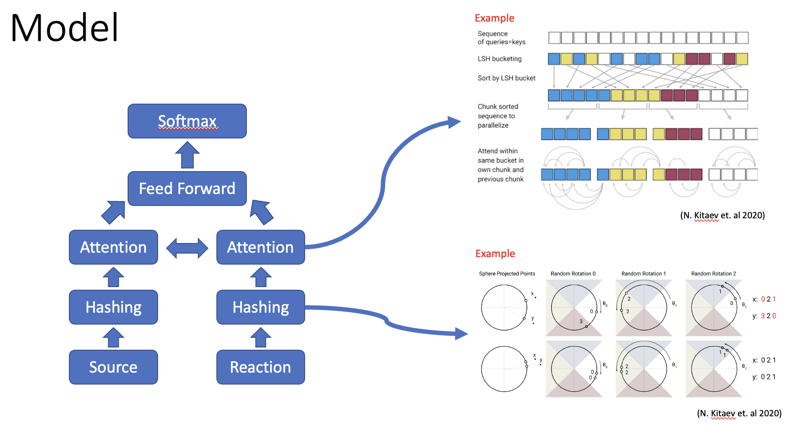

# auto-factcheck

🏆 **2021 KIICE 춘계학술대회 우수논문상**

LSH 기반 어텐션으로 Transformer 연산 병목을 해결한 팩트체크 모델.
기존 대비 학습 시간 3배 단축, 정확도 75% 달성.


## Highlights

- **학습 시간 3배 단축** — LSH 어텐션으로 O(n²) → O(n log n) 복잡도 감소
- **정확도 75%, F1 Macro 75%** — PHEME 데이터셋 기준
- **학회 수상** — 2021 한국정보통신학회 춘계학술대회 우수논문상

## Quick Start
```bash
git clone https://github.com/HenryYoon/auto-factcheck.git
cd auto-factcheck
pip install -r requirements.txt
./src/execute.bat        # Windows
./src/execute.sh     # Linux/Mac
```

## Method Overview

<!-- 모델 아키텍처 다이어그램 -->


Locality Sensitive Hashing(LSH)을 활용해 의미적으로 유사한 토큰을 그룹화한 뒤,
그룹 내에서만 어텐션을 계산한다. 전체 시퀀스 대상 어텐션 대비 연산량을 크게 줄이면서
성능 손실을 최소화했다.

## Results

| Model | Accuracy | F1 Micro | F1 Macro | Train Time |
|-------|----------|----------|----------|------------|
| BERT | **99.9%** | **99.9%** | **99.9%** | 63min |
| Bi-LSTM | 65.6% | 65.6% | 99.9% | 3min |
| Bi-GRU | 65.6% | 65.6% | 99.9% | 3min |
| Bi-RNN | 65.6% | 65.6% | 99.9% | 3min |
| **Ours (LSH Transformer)** | 75.0% | 42.9% | 75.0% | **20min** |

## Tech Stack

`PyTorch` · `Transformers` · `Pandas` · `Scikit-learn`

## Citation
```bibtex
@inproceedings{yun2021factcheck,
  title={Explainable Fact Checking Model Based on Efficient Transformer},
  author={Yun, H., Jung, J. J., Lee, G., Jung, D., & Kim, K.},
  booktitle={KIICE Spring Conference},
  year={2021}
}
```